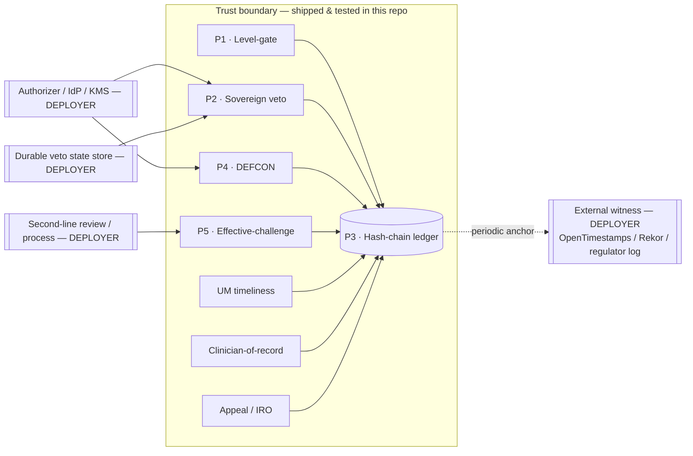

# Architecture

*How `payer-agent-audit` is put together, and — more importantly — where the
trust boundary is drawn. The honesty thesis of this library is visible here:
the dotted boxes are the deployer's responsibility, and the library says so.*

## Trust boundary



**Inside the boundary** (shipped, tested, 100% covered): the five governance
primitives (P1–P5) and the three module-(a) health-payer controls, all writing
to the P3 hash-chain ledger. These are reference patterns, not a deployed
control.

**Outside the boundary** (the deployer's responsibility, by design):

| Responsibility | Why it's the deployer's | Where it's documented |
|---|---|---|
| External witness anchor | The hash chain is internally consistent but an attacker with write access can regenerate it end-to-end; only an out-of-band witness makes that detectable | `witness_anchor.py`, LIMITATIONS §6 |
| Authorizer / IdP / KMS | `operator_id` is only as strong as the principal check behind it | `sovereign_veto.py`, LIMITATIONS §8 |
| Durable veto state store | The default store is in-memory and lost on restart | `sovereign_veto.py`, LIMITATIONS §9 |
| Second-line review process | Challenger independence is an operator attestation, not code-detected | `effective_challenge_harness.py`, LIMITATIONS §10 |

## Advisory vs production mode

Every enforcing primitive ships with two postures:

- **Advisory (default).** Backward-compatible, warns, records but does not
  enforce. The level-gate is permanently advisory (`ADVISORY = True`).
- **Production (`production=True`, strict opt-in).** Fails closed — the
  constructor refuses to start without the controls it needs: a witness anchor
  + deployer-keyed genesis (P3), a wired Authorizer (P2, P4). The default is
  never flipped; production is opt-in only.

## Module layout

```
src/payer_agent_audit/
  _normalize.py        # NFKC + zero-width identity normalization (guard hardening)
  schemas/audit_event  # AuditEvent (frozen, hash-chained) + AuditEventType + AutonomyLevel
  governance/          # P1 autonomy_ladder · P2 sovereign_veto · P3 audit_chain
                       # P4 defcon · P5 effective_challenge_harness · witness_anchor
  payer/               # funding_type (CMS/ERISA/state-DOI/ACA routing)
                       # um_timeliness · clinician_of_record · appeal_iro
  cli.py               # payer-audit: info · verify · obligations
```

## Data flow (one governed decision)

1. A request arrives; the deployer routes it to `obligations_for(funding_type, category)`.
2. `UMTimelinessControl` checks the decision clock against the funding-type
   deadline and appends a `UM_TIMELINESS_CHECKED` event.
3. On a medical-necessity denial, `ClinicianOfRecordControl` refuses the denial
   unless an attested licensed clinician of record is present (recording a
   `POLICY_VIOLATION` on refusal).
4. `AppealIROControl` records the adverse determination and routes appeal / IRO
   rights, enforcing ERISA full-and-fair-review reviewer independence.
5. The P3 ledger hash-chains every event; the deployer periodically anchors the
   chain head to an external witness.

See [README.md](README.md), [LIMITATIONS.md](LIMITATIONS.md), and
[FAILURE-MODES.md](FAILURE-MODES.md) for the full claim-layer and threat model.
